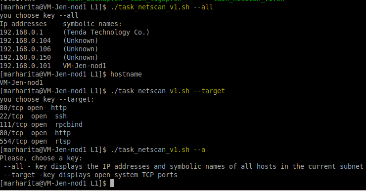
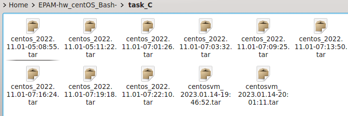
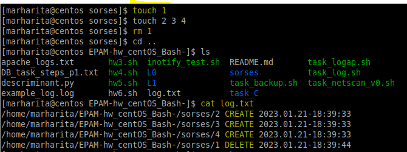
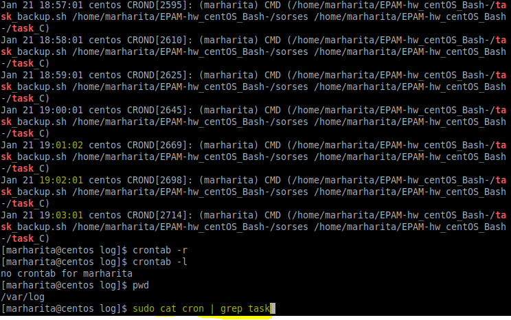

# Linux administration with bash. Home task
## A. Create a script that uses the following keys:
1. When starting without parameters, it will display a list of possible keys and their description. 
2. The --all key displays the IP addresses and symbolic names of all hosts in the current subnet 
3. The --target key displays a list of open system TCP ports.
The code that performs the functionality of each of the subtasks must be placed in a separate function

----
## Solution
The skript with solution is presented in files: A_task_netscan_(v).sh. There are two versions of the code.
+ [A_task_netscan_v0.sh](A_task_netscan_v0.sh) (use `arp` utility):

```bash
#! /usr/bin/env bash

echo "Please, choise a key: --all; --target"
# Function for listing opened TCP ports:
function openedTCP
{
netstat -tln | grep LISTEN
}
# Function for showing IP addresses and symbolic names of all hosts in the current subnet
function netscan
{
arp -a | grep ether | awk 'BEGIN { print "ip addresses", "\t", "symbolic names" } { print $2, "\t", $1 }' 
}

case $1 in 
  "--all" )
	echo "you choose key --all"
	netscan
	hostname -I | tr '\n' \\t; hostname -f | awk '{ print $1 }'
    ;;
   "--target" ) 
	echo "you choose key --target:"
	openedTCP
    ;;
	*) echo "Please, choise a key:
 --all - key displays the IP addresses and symbolic names of all hosts in the current subnet
 --target -key displays open system TCP ports"
    ;;
esac

```
## Output:
```
[marharita@VM-Jen-nod1 L1]$ ./task_netscan_v0.sh --all
you choose key --all
ip addresses     symbolic names
(192.168.0.150)          ?
(192.168.0.1)    gateway
(192.168.0.102)          ?
(192.168.0.106)          ?
(192.168.0.100)          ?
(192.168.0.104)          ?
192.168.0.103   centosvm
[marharita@VM-Jen-nod1 L1]$ ./task_netscan_v0.sh --all
you choose key --all
ip addresses     symbolic names
(192.168.0.150)          ?
(192.168.0.1)    gateway
(192.168.0.102)          ?
(192.168.0.106)          ?
(192.168.0.100)          ?
(192.168.0.104)          ?
192.168.0.103   centosvm
[marharita@VM-Jen-nod1 L1]$ ./task_netscan_v0.sh --target
you choose key --target:
tcp        0      0 0.0.0.0:111             0.0.0.0:*               LISTEN     
tcp        0      0 0.0.0.0:22              0.0.0.0:*               LISTEN     
tcp        0      0 127.0.0.1:631           0.0.0.0:*               LISTEN     
tcp6       0      0 :::111                  :::*                    LISTEN     
tcp6       0      0 :::22                   :::*                    LISTEN     
tcp6       0      0 ::1:631                 :::*                    LISTEN     
[marharita@VM-Jen-nod1 L1]$ ./task_netscan_v0.sh --tar
Please, choise a key:
 --all - key displays the IP addresses and symbolic names of all hosts in the current subnet
 --target -key displays open system TCP ports
```

+ [A_task_netscan_v1.sh](A_task_netscan_v1.sh) (use `nmap` utility):

```bash
ip addr | grep global | awk '{ print $2 }' > ipaddr.txt
touch file1.txt file2.txt

# Function for listing opened TCP ports:
function openedTCP
{
nmap -sT -iL ipaddr.txt | grep open
}

# Functions for showing IP addresses and symbolic names of all hosts in the current subnet
function ipscan
{
sudo nmap -sP -iL ipaddr.txt | grep report |awk 'BEGIN { print "Ip addresses" } { print $5 }'  | sed '$d'
}

function hostscan
{
sudo nmap -sP -iL ipaddr.txt | grep MAC |awk 'BEGIN { print "symbolic names:"  } { print $4, $5, $6 }'
}

case $1 in 
  "--all" )
	echo "you choose key --all"
	ipscan > file1.txt
	hostscan > file2.txt
	paste file1.txt file2.txt
	rm file1.txt
	rm file2.txt
	hostname -I | tr '\n' \\t; hostname -f | awk '{ print $1 }'
	;;
   "--target" ) 
	echo "you choose key --target:"
	openedTCP
	;;
	*) echo "Please, choose a key:
 --all - key displays the IP addresses and symbolic names of all hosts in the current subnet
 --target -key displays open system TCP ports"
 	;;
esac
```
## Output:


----
## B. Using Apache log example create a script to answer the following questions:
1. From which ip were the most requests? 
2. What is the most requested page? 
3. How many requests were there from each ip? 
4. What non-existent pages were clients referred to? 
5. What time did site get the most requests? 
6. What search bots have accessed the site? (UA + IP)

## Solution
+ [B_task_log.sh](./B_task_log.sh)
  
The `log` directory contains the log files that were used to test the script.

```bash
#! /usr/bin/env bash
echo "enter path to the file with access logs"
read logs
echo "Using Apache log the script answers to  the following questions:
1. From which ip were the most requests?		 coise 1
2. What is the most requested page?			 coise 7 
3. How many requests were there from each ip?	 	 coise 3
4. What time did site get the most requests?    	 coise 4
5. What non-existent pages were clients referred to?  	 coise 5
6. What search bots have accessed the site? (UA + IP)	 coise 6"

echo "Input number of your choise"
read num

all_req=$( cat $logs | cut -d' ' -f1 | sort | uniq -c | sort -nr | awk 'BEGIN { print "IP", "\t\t", "requests" } { print $2, "\t ",  $1 }' )
non_ex=$( cat $logs | grep "error404" | sort | uniq -c | sort -nr )
bots=$(awk -F'|' '!/Applebot|Googlebot|bingbot|YandexBot|SentiBot|AhrefsBot/' $logs | sort | uniq -c | sort -nr | awk 'BEGIN { print "UA", "\t\t", "IP" } { print $13, "\t ",  $2 }' | uniq )

f_request ()
{
awk -v a=$num '{ print $a }' $logs | sort | uniq -c | sort -nr | head -1 | awk '{print $2}'
}
case $num in
	1) echo "The most requestes ip were from $( f_request ) " ;;
	7) echo "The most requested page is $( f_request ) " ;;
	3) echo "All requests from each ip: 
$all_req" ;;
	4) echo "The most requests get in time $( f_request ) " ;;
	5) if [[ -n $non_ex ]] ; then echo "Clients referred to non-existent pages: 
$non_ex"
	   else echo "Clients didn't refer to non-existent pages"
	   fi ;;
	6) echo "Search bots have accessed the site
$bots" ;;
esac
```
## Output:

```
[marharita@VM-Jen-nod1 L1]$ ./task_log.sh
enter path to the file with access logs
/home/marharita/EPAM-hw_centOS_Bash-/L1/example_log.log 
Using Apache log the script answers to  the following questions:
1. From which ip were the most requests?                 coise 1
2. What is the most requested page?                      coise 7 
3. How many requests were there from each ip?            coise 3
4. What time did site get the most requests?             coise 4
5. What non-existent pages were clients referred to?     coise 5
6. What search bots have accessed the site? (UA + IP)    coise 6
Input number of your choise
1
The most requestes ip were from 94.78.95.154 

[marharita@VM-Jen-nod1 L1]$ ./task_log.sh
.......
Input number of your choise
7
The most requested page is /wp-content/uploads/2014/11/favicon.ico 
 
[marharita@VM-Jen-nod1 L1]$ ./task_log.sh
 ...
Input number of your choise
3
All requests from each ip: 
   IP            requests
94.78.95.154      29
95.31.14.165      21
176.108.5.105     19
31.7.230.210      16
144.76.76.115     14
217.69.133.239    12
66.102.9.35       11
5.255.251.28      11
217.69.133.234    11
188.123.232.29    11
91.121.209.185    10
46.158.68.55      10
93.170.253.156    9
5.135.154.105     9
217.69.133.236    9
91.206.110.87     8
82.193.140.164    8
66.102.9.32       8
............

[marharita@VM-Jen-nod1 L1]$ ./task_log.sh
Input number of your choise
4
The most requests get in time [25/Apr/2017:11:40:56 

[marharita@VM-Jen-nod1 L1]$ ./task_log.sh
enter path to the file with access logs
apache_logs.txt
........
Input number of your choise
5
Clients referred to non-existent pages:
      1 207.46.13.48 - - [30/Sep/2015:02:26:26 +0300] "GET /error404 HTTP/1.0" 200 2385 "-" "Mozilla/5.0 (compatible; bingbot/2.0; +http://www.bing.com/bingbot.htm)"
      1 157.55.39.250 - - [30/Sep/2015:02:11:10 +0300] "GET /error404 HTTP/1.0" 200 2385 "-" "Mozilla/5.0 (compatible; bingbot/2.0; +http://www.bing.com/bingbot.htm)"
      1 157.55.39.174 - - [30/Sep/2015:00:27:43 +0300] "GET /error404 HTTP/1.0" 200 2385 "-" "Mozilla/5.0 (compatible; bingbot/2.0; +http://www.bing.com/bingbot.htm)"
   
[marharita@VM-Jen-nod1 L1]$ ./task_log.sh
enter path to the file with access logs
apache_logs.txt
........
Input number of your choise
6
Search bots have accessed the site:
UA               IP
 Mediapa  66.249.78.72
"Mozilla/5.0      66.249.78.58
"Wget/1.12        46.29.2.62
 -"       46.29.2.62
"Wget/1.12        46.29.2.62
 -"       46.29.2.62
"Wget/1.12        46.29.2.62
"Mozilla/5.0      217.69.134.39
"Mozilla/5.0      217.69.134.29
"Mozilla/5.0      217.69.134.15
"Mozilla/5.0      217.69.134.13
"Mozilla/5.0      217.69.134.12
"Mozilla/5.0      217.69.134.11
"Mozilla/5.0      213.87.151.38
"Mozilla/5.0      185.53.44.186
"Mozilla/5.0      178.76.227.154
"Mozilla/5.0      176.59.119.104
```
----

## C. Create a data backup script that takes the following data as parameters:
1. Path to the syncing directory.
2. The path to the directory where the copies of the files will be stored.
In case of adding new or deleting old files, the script must add a corresponding entry to the log file 
indicating the time, type of operation and file name. [The command to run the script must be added to 
crontab with a run frequency of one minut

## Solution
+ [C_task_backup.sh](./C_task_backup.sh):

```bash
#! /usr/bin/env bash
echo " Input path to syncing directory (What to backup)"
read SYNDIR
echo "Input the path to the directory where the copies of the files will be stored (Where to backup to)"
read STORDIR

# Create archive filename
BDATE=$( date +'%Y.%m.%d-%H:%M:%S' )
FILENAME=$( hostname -s )_$BDATE

#Backing up the files
## Create change monitoring function
event=create,delete
f_monitoring(){
inotifywait -q -m -e $event $STORDIR --format '%w%f %e %T' --timefmt '%Y.%m.%d-%H:%M:%S' > log.txt &
}

echo "Monitoring $STORDIR  $( f_monitoring ) " 
##kill the monitor on backup restore done, and/or on script exit
wrapup() {
    [[ $COPROC_PID ]] && kill -INT "$COPROC_PID"
}

trap 'wrapup'  EXIT
#Backing up the files
tar -cf $STORDIR/$FILENAME.tar $SYNDIR
```
## Output
```
[marharita@VM-Jen-nod1 L1]$ ./task_backup.sh
 Input path to syncing directory (What to backup)
/home/marharita/EPAM-hw_centOS_Bash-/sorses
Input the path to the directory where the copies of the files will be stored (Where to backup to)
/home/marharita/EPAM-hw_centOS_Bash-/task_C
Monitoring /home/marharita/EPAM-hw_centOS_Bash-/task_C   
tar: Removing leading `/' from member names
```

After script execution there is tar file adding  in `$STORDIR` 
(in my case it was /home/marharita/EPAM-hw_centOS_Bash-/task_C):



Do change in syncing directory. And see log file with a corresponding entry:



Add backup script to **crontab** with frequency of 1 minute:

```
[marharita@VM-Jen-nod1 L1]$ crontab -e
crontab: installing new crontab
```

```
[marharita@VM-Jen-nod1 L1]$ crontab -l
```
Add in file:
```
*/1 * * * * /home/marharita/EPAM-hw_centOS_Bash-/task_backup.sh /home/marharita/EPAM-hw_centOS_Bash-/sorses /home/marharita/EPAM-hw_centOS_Bash-/task_C
```
See results in syslogs (/var/log):
```
$ sudo cat cron | grep task
```



Clean up 
```
[marharita@VM-Jen-nod1 log]$ crontab -r
[marharita@VM-Jen-nod1 log]$ crontab -l
no crontab for marharita
```


  
