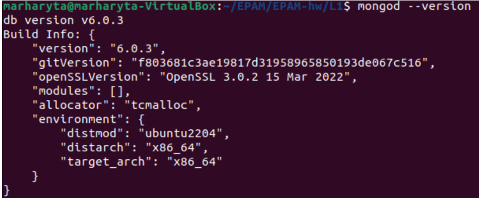

# <center> EPAM University Programs</center>
  <center> DevOps L1 course </center>

 ## <center> Database Administration </center> 

<center>TASK DB1</center>

**[PART 1](task_DBsteps_p1.txt)**
1. **[Download](https://www.mysql.com/downloads/) MySQL server for your OS on VM.**
2. **Install MySQL server on VM.**
3. **Select a subject area and describe the database schema, (minimum 3 tables)**

```
marharyta@marharyta-VirtualBox:~$ mysql -uroot -p
Enter password: 
Welcome to the MySQL monitor.  Commands end with ; or \g.
Your MySQL connection id is 12
Server version: 8.0.31-0ubuntu0.22.04.1 (Ubuntu)....

mysql> SHOW databases;
+--------------------+
| Database           |
+--------------------+
| information_schema |
| mysql              |
| performance_schema |
| sys                |
+--------------------+
```
4. **Create a database on the server through the console.**

```sql
mysql> show create database repair_cost;
+-------------+------------------------------------------------------------+
| Database    | Create Database                                                                                                                       |
+---------------------------------------------------------------+
| repair_cost | CREATE DATABASE `repair_cost` /*!40100 DEFAULT CHARACTER SET utf8mb4 COLLATE utf8mb4_0900_ai_ci */ /*!80016 DEFAULT ENCRYPTION='N' */ |
+----------------------------------------------------------------+

mysql> USE repair_cost;
Database changed
```
5. **Fill in tables.**

```sql
mysql> create table turnkey_services( n_id INT, date DATE, name varchar(30) NOT NULL, price DEC(10,2), primary key(n_id) );

mysql> describe turnkey_services;
+-------+---------------+------+-----+---------+-------+
| Field | Type          | Null | Key | Default | Extra |
+-------+---------------+------+-----+---------+-------+
| n_id  | int           | NO   | PRI | NULL    |       |
| date  | date          | YES  |     | NULL    |       |
| name  | varchar(30)   | NO   |     | NULL    |       |
| price | decimal(10,2) | YES  |     | NULL    |       |
+-------+---------------+------+-----+---------+-------+

mysql> INSERT INTO turnkey_services( n_id, date, name, price ) VALUES (3,'2018-11-6', 'electric instalation', 31000);

mysql> INSERT INTO turnkey_services( n_id, date, name, price ) VALUES (1,'2018-10-26', 'plumbing instalation', 20000);

INSERT INTO turnkey_services( n_id, date, name, price ) VALUES ( 5,'2018-10-26', 'doors instalation', 38800+3600 );

UPDATE turnkey_services SET date='2020-08-19' WHERE n_id=5

mysql> SELECT * FROM  turnkey_services;
+------+------------+----------------------+----------+
| n_id | date       | name                 | price    |
+------+------------+----------------------+----------+
|    1 | 2018-10-26 | plumbing instalation | 20000.00 |
|    3 | 2018-11-06 | electric instalation | 31000.00 |
|    5 | 2020-08-19 | doors instalation    | 42400.00 |
+------+------------+----------------------+----------+

mysql> create table decoration_materials( n_id INT, date DATE, name varchar(30) NOT NULL, amount int, price DEC(10,2), primary key(n_id) );

mysql> describe decoration_materials;
+--------+--------------+------+-----+---------+-------+
| Field  | Type         | Null | Key | Default | Extra |
+--------+--------------+------+-----+---------+-------+
| n_id   | int          | NO   | PRI | NULL    |       |
| date   | date         | YES  |     | NULL    |       |
| name   | varchar(30)  | NO   |     | NULL    |       |
| amount | int          | YES  |     | NULL    |       |
| price  | decimal(10,2) | YES  |     | NULL    |       |
+--------+--------------+------+-----+---------+-------+

mysql> INSERT INTO decoration_materials( n_id, date, name, amount, price ) VALUES ( 1,'2019-01-29', 'laminate', 28, 28*340);

mysql> INSERT INTO decoration_materials( n_id, date, name, amount, price ) VALUES (8,'2019-02-25', 'switchers legrand', 40, 40*292.35 );

mysql> INSERT INTO decoration_materials( n_id, date, name, amount, price ) VALUES (5,'2019-01-29', 'oil colors', 32, 620+4300+320+1415 );

mysql> SELECT * FROM decoration_materials;
+------+------------+-------------------+--------+----------+
| n_id | date       | name              | amount | price    |
+------+------------+-------------------+--------+----------+
|    1 | 2019-01-29 | laminate          |     28 |  9520.00 |
|    5 | 2019-01-29 | oil colors        |     32 |  6655.00 |
|    8 | 2019-02-25 | switchers legrand |     40 | 11694.00 |
+------+------------+-------------------+--------+----------+

mysql> create table technique( n_id INT, date DATE, name varchar(30) NOT NULL, price DEC, end_guarantee DATE, primary key(n_id) );

mysql> describe technique;
+---------------+---------------+------+-----+---------+-------+
| Field         | Type          | Null | Key | Default | Extra |
+---------------+---------------+------+-----+---------+-------+
| n_id          | int           | NO   | PRI | NULL    |       |
| date          | date          | YES  |     | NULL    |       |
| name          | varchar(30)   | NO   |     | NULL    |       |
| price         | decimal(10,0) | YES  |     | NULL    |       |
| end_guarantee | date          | YES  |     | NULL    |       |
+---------------+---------------+------+-----+---------+-------+

INSERT INTO technique( n_id, date, name, price, end_guarantee ) VALUES (1,'2019-03-22', 'oven', 11243, '2024-03-22' );

mysql> INSERT INTO technique( n_id, date, name, price, end_guarantee ) VALUES (3,'2019-03-29', 'dishwasher', 15194, '2024-03-29' );

mysql> INSERT INTO technique( n_id, date, name, price, end_guarantee ) VALUES (2,'2019-03-29', 'microware', 6236, '2024-03-29' );

mysql> SELECT * FROM technique;
+------+------------+------------+-------+---------------+
| n_id | date       | name       | price | end_guarantee |
+------+------------+------------+-------+---------------+
|    1 | 2019-03-22 | oven       | 11243 | 2024-03-22    |
|    2 | 2019-03-29 | microware  |  6236 | 2024-03-29    |
|    3 | 2019-03-29 | dishwasher | 15194 | 2024-03-29    |
+------+------------+------------+-------+---------------+
3 rows in set (0,01 sec)

mysql> SHOW tables;
+-----------------------+
| Tables_in_repair_cost |
+-----------------------+
| decoration_materials  |
| technique             |
| turnkey_services      |
+-----------------------+
3 rows in set (0,00 sec)

```

6. **Construct and execute SELECT operator with WHERE, GROUP BY and ORDER BY.**
```sql
mysql> SELECT name FROM technique  WHERE end_guarantee='2024-03-29';
+------------+
| name       |
+------------+
| microware  |
| dishwasher |
+------------+

mysql> SELECT name FROM technique  WHERE end_guarantee>=date;
+------------+
| name       |
+------------+
| oven       |
| microware  |
| dishwasher |
+------------+

mysql> SELECT name, MAX(price) FROM technique GROUP BY name;
+------------+------------+
| name       | MAX(price) |
+------------+------------+
| oven       |      11243 |
| microware  |       6236 |
| dishwasher |      15194 |
+------------+------------+

mysql> SELECT name, MIN(end_guarantee) FROM technique GROUP BY name;
+------------+--------------------+
| name       | MIN(end_guarantee) |
+------------+--------------------+
| oven       | 2024-03-22         |
| microware  | 2024-03-29         |
| dishwasher | 2024-03-29         |
+------------+--------------------+

mysql> SELECT DISTINCT name FROM technique ORDER BY name;
+------------+
| name       |
+------------+
| dishwasher |
| microware  |
| oven       |
+------------+

mysql> SELECT DISTINCT name FROM decoration_materials ORDER BY name;
+-------------------+
| name              |
+-------------------+
| laminate          |
| oil colors        |
| switchers legrand |
+-------------------+
```
7. **Execute other different SQL queries DDL, DML, DCL.**
- DDL:ALTER, RENAME, DROP
- DML:UPDATE,INSERT,DELETE
- DQL:SELECT
- DCL:GRANT,REVOKE (use in next step)

```sql
mysql> ALTER TABLE turnkey_services ADD COLUMN contractor VARCHAR(10) AFTER price;
mysql> select * from turnkey_services;
+------+------------+----------------------+----------+------------+
| n_id | date       | name                 | price    | contractor |
+------+------------+----------------------+----------+------------+
|    1 | 2018-10-26 | plumbing instalation | 20000.00 | NULL       |
|    3 | 2018-11-06 | electric instalation | 31000.00 | NULL       |
|    5 | 2020-08-19 | doors instalation    | 42400.00 | NULL       |
+------+------------+----------------------+----------+------------+

ALTER TABLE turnkey_services RENAME TO repair_services;

mysql> UPDATE repair_services SET contractor='Alex';
mysql> SELECT * from repair_services;
+------+------------+----------------------+----------+------------+
| n_id | date       | name                 | price    | contractor |
+------+------------+----------------------+----------+------------+
|    1 | 2018-10-26 | plumbing instalation | 20000.00 | Alex       |
|    3 | 2018-11-06 | electric instalation | 31000.00 | Alex       |
|    5 | 2020-08-19 | doors instalation    | 42400.00 | Alex       |
+------+------------+----------------------+----------+------------+

mysql> UPDATE repair_services SET contractor='Viktor' WHERE name='doors instalation';
mysql> SELECT * from repair_services;
+------+------------+----------------------+----------+------------+
| n_id | date       | name                 | price    | contractor |
+------+------------+----------------------+----------+------------+
|    1 | 2018-10-26 | plumbing instalation | 20000.00 | Alex       |
|    3 | 2018-11-06 | electric instalation | 31000.00 | Alex       |
|    5 | 2020-08-19 | doors instalation    | 42400.00 | Viktor     |
+------+------------+----------------------+----------+------------+

mysql> ALTER TABLE decoration_materials DROP COLUMN amount;
mysql> SELECT * from decoration_materials;
+------+------------+-------------------+----------+
| n_id | date       | name              | price    |
+------+------------+-------------------+----------+
|    1 | 2019-01-29 | laminate          |  9520.00 |
|    5 | 2019-01-29 | oil colors        |  6655.00 |
|    8 | 2019-02-25 | switchers legrand | 11694.00 |
+------+------------+-------------------+----------+

INSERT INTO decoration_materials( n_id, date, name, price ) VALUES ( 2,'2019-01-09', 'tile(kitchen)', 4165+1300);
mysql> SELECT * from decoration_materials;
+------+------------+-------------------+----------+
| n_id | date       | name              | price    |
+------+------------+-------------------+----------+
|    1 | 2019-01-29 | laminate          |  9520.00 |
|    2 | 2019-01-09 | tile(kitchen)     |  5465.00 |
|    5 | 2019-01-29 | oil colors        |  6655.00 |
|    8 | 2019-02-25 | switchers legrand | 11694.00 |
+------+------------+-------------------+----------+

mysql> DELETE FROM decoration_materials WHERE n_id=5;
mysql> SELECT * from decoration_materials;
+------+------------+-------------------+----------+
| n_id | date       | name              | price    |
+------+------------+-------------------+----------+
|    1 | 2019-01-29 | laminat           |  9520.00 |
|    2 | 2019-01-09 | tile(kitchen)     |  5465.00 |
|    8 | 2019-02-25 | switchers legrand | 11694.00 |
+------+------------+-------------------+----------+
```

8. **Create a database of new users with different privileges. Connect to the database as a new user and verify that the privileges allow or deny certain actions**
```sql
mysql> CREATE DATABASE home_accounting;
mysql> SHOW databases;
+--------------------+
| Database           |
+--------------------+
| home_accounting    |
| information_schema |
| mysql              |
| performance_schema |
| repair_cost        |
| sys                |
+--------------------+
mysql> use home_accounting;
Database changed

mysql> create table expenses ( name varchar(30) NOT NULL, date DATE, sum_fact DEC(10,2) NOT NULL, sum_plan DEC(10,2) NOT NULL );

mysql> create table income ( name varchar(30) NOT NULL, date DATE, sum_fact DEC(10,2) NOT NULL, sum_plan DEC(10,2) NOT NULL );

mysql> CREATE USER 'msql_user1'@'localhost' IDENTIFIED BY 'User1_321';
mysql> CREATE USER 'msql_user2'@'localhost' IDENTIFIED BY 'User2_321';

GRANT SELECT ON home_accounting.* TO 'msql_user1'@'localhost';
GRANT ALL PRIVILEGES ON home_accounting.* TO msql_user2 WITH GRANT OPTIONS;

mysql> describe income;
+----------+---------------+------+-----+---------+-------+
| Field    | Type          | Null | Key | Default | Extra |
+----------+---------------+------+-----+---------+-------+
| name     | varchar(30)   | NO   |     | NULL    |       |
| date     | date          | YES  |     | NULL    |       |
| sum_fact | decimal(10,2) | NO   |     | NULL    |       |
| sum_plan | decimal(10,2) | NO   |     | NULL    |       |
+----------+---------------+------+-----+---------+-------+

INSERT INTO expenses ( name, date, sum_fact, sum_plan ) VALUES ('products', 2022-01-31, 2279, 2500);

mysql> INSERT INTO expenses ( name, date, sum_fact, sum_plan ) VALUES ('clothes', '2022-01-31', 900, 500);

mysql> select * from expenses;
+----------+------------+----------+----------+
| name     | date       | sum_fact | sum_plan |
+----------+------------+----------+----------+
| products | 2022-01-31 |  2279.00 |  2500.00 |
| clothes  | 2022-01-31 |   900.00 |   500.00 |
+----------+------------+----------+----------+

INSERT INTO income ( name, date, sum_fact, sum_plan ) VALUES ('deposits', '2022-01-31', 12.50, 12.50);
mysql> INSERT INTO income ( name, date, sum_fact, sum_plan ) VALUES ('salary',
'2022-01-31', 12500, 10000 );

mysql> select * from income;
+----------+------------+----------+----------+
| name     | date       | sum_fact | sum_plan |
+----------+------------+----------+----------+
| deposits | 2022-01-31 |    12.50 |    12.50 |
| salary   | 2022-01-31 | 12500.00 | 10000.00 |
+----------+------------+----------+----------+
2 rows in set (0,00 sec)

>exit
```
```
$ mysql -u msql_user1 -p
Enter password: .....
.....
``` 
```sql
mysql> use home_accounting
....
mysql> INSERT INTO income ( name, date, sum_fact, sum_plan ) VALUES ('freelans', '2022-01-31', 1000, 1500 );
Query OK, 1 row affected (0,01 sec)

mysql> ALTER TABLE income DROP COLUMN sum_plan;
ERROR 1142 (42000): ALTER command denied to user 'msql_user1'@'localhost' for table 'income'
>exit
mysql -u msql_user2 -p
Enter password: .....
.....
mysql> use home_accounting
Reading table information for completion of table and column names
You can turn off this feature to get a quicker startup with -A
Database changed

mysql> ALTER TABLE income DROP COLUMN sum_plan;
Query OK, 0 rows affected (0,06 sec)
Records: 0  Duplicates: 0  Warnings: 0
```

9. **Make a selection from the main table DB MySQL**
    
```sql
mysql> SELECT User, host, plugin FROM mysql.user;
+------------------+-----------+-----------------------+
| User             | host      | plugin                |
+------------------+-----------+-----------------------+
| debian-sys-maint | localhost | caching_sha2_password |
| marharyta        | localhost | caching_sha2_password |
| msql_user1       | localhost | caching_sha2_password |
| msql_user2       | localhost | caching_sha2_password |
| mysql.infoschema | localhost | caching_sha2_password |
| mysql.session    | localhost | caching_sha2_password |
| mysql.sys        | localhost | caching_sha2_password |
| root             | localhost | mysql_native_password |
+------------------+-----------+-----------------------+
```
[**PART 2**](task_DBsteps_p2.txt)

**10. Make backup of your database.**
```sql
mysql> SHOW databases;
+--------------------+
| Database           |
+--------------------+
| home_accounting    |
| information_schema |
| mysql              |
| performance_schema |
| repair_cost        |
| sys                |
+--------------------+
$ mkdir ~/my_backups/
$ mysqldump -u root -p repair_cost > ~/my_backups/repair_cost_bckp.sql
$ ls ~/my_backups/
repair_cost_bckp.sql
```
**11. Delete the table and/or part of the data in the table.**
```sql
mysql> USE repair_cost;
Database changed

mysql> SHOW tables;
+-----------------------+
| Tables_in_repair_cost |
+-----------------------+
| decoration_materials  |
| repair_services       |
| technique             |
+-----------------------+

mysql> DROP TABLE technique;
mysql> SHOW tables;
+-----------------------+
| Tables_in_repair_cost |
+-----------------------+
| decoration_materials  |
| repair_services       |
+-----------------------+

mysql> SELECT * from repair_services;
+------+------------+----------------------+----------+------------+
| n_id | date       | name                 | price    | contractor |
+------+------------+----------------------+----------+------------+
|    1 | 2018-10-26 | plumbing instalation | 20000.00 | Alex       |
|    3 | 2018-11-06 | electric instalation | 31000.00 | Alex       |
|    5 | 2020-08-19 | doors instalation    | 42400.00 | Viktor     |
+------+------------+----------------------+----------+------------+

mysql> DELETE FROM repair_services WHERE contractor='Alex';
mysql> SELECT * from repair_services;
+------+------------+-------------------+----------+------------+
| n_id | date       | name              | price    | contractor |
+------+------------+-------------------+----------+------------+
|    5 | 2020-08-19 | doors instalation | 42400.00 | Viktor     |
+------+------------+-------------------+----------+------------+
> exit
```

**12. Restore your database.**

+ For restore database use backup and command:
```
$ mysql -u root -p repair_cost < ~/my_backups/repair_cost_bckp.sql
$ mysql -u root -p
```
```sql
mysql> USE repair_cost;
Database changed
mysql> SHOW tables;
+-----------------------+
| Tables_in_repair_cost |
+-----------------------+
| decoration_materials  |
| repair_services       |
| technique             |
+-----------------------+

mysql> SELECT * from repair_services;
+------+------------+----------------------+----------+------------+
| n_id | date       | name                 | price    | contractor |
+------+------------+----------------------+----------+------------+
|    1 | 2018-10-26 | plumbing instalation | 20000.00 | Alex       |
|    3 | 2018-11-06 | electric instalation | 31000.00 | Alex       |
|    5 | 2020-08-19 | doors instalation    | 42400.00 | Viktor     |
+------+------------+----------------------+----------+------------+
```
**13.Transfer your local database to RDS AWS.**
+ Set local machine:
```
$ sudo vi /etc/mysql/mysql.conf.d/mysqld.cnf
```
```
[mysqld]
log-bin=mysql-bin
server-id=1 
```
+ Restart service
```
$ sudo service mysql restart
```
+ Create RDS instance on AWS:
  
  
  

  
+ Add indoard ruls assosiated with local VM where is DB:

+ Create database baskup and sent it to RDS instance:

```
  $ mysqldump -u root \
    --databases repair_cost \
    --single-transaction \
    -p12345678 | mysql -u marharyta \
    --port=3306 \
    --host=msql-epam-task.crljd2jlc9ed.eu-central-1.rds.amazonaws.com \
     -paws12345678

mysql: mysqldump: [Warning] Using a password on the command line interface can be insecure.
[Warning] Using a password on the command line interface can be insecure.

```
**14. Connect to your database.**

```
$ mysql -h msql-epam-task.crljd2jlc9ed.eu-central-1.rds.amazonaws.com -u marharyta -p 
Enter password: 
Welcome to the MySQL monitor.  Commands end with ; or \g.
Your MySQL connection id is 25
Server version: 8.0.31 Source distribution

mysql> show databases;
+--------------------+
| Database           |
+--------------------+
| information_schema |
| msqltask           |
| mysql              |
| performance_schema |
| repair_cost        |
| sys                |
+--------------------+
```
 

**I did a same steps for Centos7 VM. Note! Install MariaDB instead MySql. Output in Centos7 VM for step_14:**
```
[root@centos marharita]# mysql -h msql-epam-task.crljd2jlc9ed.eu-central-1.rds.amazonaws.com -P 3306 -u marharyta -p
Enter password: 
Welcome to the MariaDB monitor.  Commands end with ; or \g.
Your MySQL connection id is 1170
Server version: 8.0.31 Source distribution
....
```
```sql
MySQL [(none)]> show databases;
+--------------------+
| Database           |
+--------------------+
| information_schema |
| msqltask           |
| mysql              |
| performance_schema |
| repair_cost        |
| sys                |
+--------------------+
6 rows in set (0.07 sec)

MySQL [(none)]> use msqltask

Database changed
MySQL [msqltask]> show tables;
+----------------------+
| Tables_in_msqltask   |
+----------------------+
| decoration_materials |
| repair_services      |
| technique            |
+----------------------+
3 rows in set (0.07 sec)
```


**15. Execute SELECT operator similar step 6.**
+ SELECT operator with WHERE, GROUP BY and ORDER BY.
```sql
MySQL [msqltask]> SELECT name FROM technique  WHERE end_guarantee='2024-03-29';
+------------+
| name       |
+------------+
| microware  |
| dishwasher |
+------------+
2 rows in set (0.17 sec)
MySQL [msqltask]> SELECT name FROM technique  WHERE end_guarantee>=date;
+------------+
| name       |
+------------+
| oven       |
| microware  |
| dishwasher |
+------------+
3 rows in set (0.09 sec)
MySQL [msqltask]> SELECT name, MAX(price) FROM technique GROUP BY name;
+------------+------------+
| name       | MAX(price) |
+------------+------------+
| oven       |      11243 |
| microware  |       6236 |
| dishwasher |      15194 |
+------------+------------+
3 rows in set (0.08 sec)

MySQL [msqltask]> SELECT DISTINCT name FROM technique ORDER BY name;
+------------+
| name       |
+------------+
| dishwasher |
| microware  |
| oven       |
+------------+
3 rows in set (0.18 sec)
```

**16. Create the dump of your database.**

```
mysqldump -u root \
    --databases repair_cost \
    --single-transaction \
    -p12345678 | mysql -u marharyta \
    --port=3306 \
    --host=msql-epam-task.crljd2jlc9ed.eu-central-1.rds.amazonaws.com \
     -paws12345678
```
     
*Exemple on MariaDB instance*
 + Connect to MariaDB instance:
```     
# mysql -h epam-task-mariadb.crljd2jlc9ed.eu-central-1.rds.amazonaws.com -P 3306 -u admin -p
```
```sql

MariaDB [(none)]> show databases;
+--------------------+
| Database           |
+--------------------+
| epam_task          |
| information_schema |
| innodb             |
| mysql              |
| performance_schema |
| sys                |
+--------------------+
6 rows in set (0.09 sec)

MariaDB [(none)]> 

MariaDB [(none)]> use epam_task;
Database changed
MariaDB [epam_task]> show tables;
Empty set (0.08 sec)
MariaDB [epam_task]> exit
Bye
```
+ Create the dump and connect
```
[root@centos marharita]# mysqldump -u root \
>     --databases home_accounting \
>     --single-transaction \
>     -p12345678 | mysql -u admin \
>     --port=3306 \
>     --host=epam-task-mariadb.crljd2jlc9ed.eu-central-1.rds.amazonaws.com \
>      -paws12345678
[root@centos marharita]# mysql -h epam-task-mariadb.crljd2jlc9ed.eu-central-1.rds.amazonaws.com -P 3306 -u admin -p
Enter password: 
Welcome to the MariaDB monitor.  Commands end with ; or \g.
Your MariaDB connection id is 192
Server version: 10.6.10-MariaDB managed by https://aws.amazon.com/rds/
.....
```
```sql
MariaDB [(none)]> show databases;
+--------------------+
| Database           |
+--------------------+
| epam_task          |
| home_accounting    |
| information_schema |
| innodb             |
| mysql              |
| performance_schema |
| sys                |
+--------------------+
7 rows in set (0.07 sec)

MariaDB [(none)]> use epam_task;
Database changed
MariaDB [epam_task]> show tables;
Empty set (0.09 sec)

> use home_accounting;
Reading table information for completion of table and column names
You can turn off this feature to get a quicker startup with -A
Database changed
MariaDB [home_accounting]> show tables;
+---------------------------+
| Tables_in_home_accounting |
+---------------------------+
| expenses                  |
| income                    |
+---------------------------+
2 rows in set (0.06 sec)
```
[**PART 3 – MongoDB**](task_DBsteps_p3.txt)
+ Installing process:
    + setting for ubuntu 22.04
```
$ wget -qO - https://www.mongodb.org/static/pgp/server-6.0.asc | sudo apt-key add -
$ echo "deb [ arch=amd64,arm64 ] https://repo.mongodb.org/apt/ubuntu jammy/mongodb-org/6.0 multiverse" | sudo tee /etc/apt/sources.list.d/mongodb-org-6.0.list
$ sudo apt-get update
$ sudo apt-get install mongodb-org
$ mongod --version
```
   

 


Next steps I did [with help](https://www.cherryservers.com/blog/how-to-install-and-start-using-mongodb-on-ubuntu-20-04):
```
$ sudo systemctl start mongod
$ sudo systemctl status mongod
● mongod.service - MongoDB Database Server
     Loaded: loaded (/lib/systemd/system/mongod.service; disabled; vendor pres>
     Active: active (running) since Mon 2022-11-21 17:59:04 EET; 3s ago
       Docs: https://docs.mongodb.org/manual
   Main PID: 8393 (mongod)
     Memory: 124.6M
        CPU: 1.430s
     CGroup: /system.slice/mongod.service
             └─8393 /usr/bin/mongod --config /etc/mongod.conf

$ mongod
{"t":{"$date":"2022-11-21T18:08:54.943+02:00"},"s":"I",  "c":"NETWORK",  "id":4915701, "ctx":"main","msg":"Initialized wire specification","attr":{"spec":{"incomingExternalClient":{"minWireVersion":0,"maxWireVersion":17},"incomingInternalClient":{"minWireVersion":0,"maxWireVersion":17},"outgoing":{"minWireVersion":6,"maxWireVersion":17},"isInternalClient":true}}}.....................
   ..................
```
```
$ sudo ss -pnltu | grep 27017
$ [sudo] password for marharyta: 
tcp   LISTEN 0      4096       127.0.0.1:27017      0.0.0.0:*    users:(("mongod",pid=8393,fd=13))
```
       
   + Connect to mongodb shell. To access MongoDB, run the following command:
  ```
$ mongosh
``` 

output:


1.   Create a database. Use the use command to connect to a new database (If it doesn't exist, Mongo will create it when you write to it).
+ Create a database
```
test> USE repeir_cost
```
+ Drop database
```
repeir_cost> db.dropDatabase()
```


**18. Create a collection. Use db.createCollection to create a collection. Run show dbs and show collections to view your database and collections.**
+ Use following comands:

```sql
> db.createCollection('decor')
> show collections
> show dbs
````


**19. Create some documents. Insert a couple of documents into your collection.**
```yaml
repair_cost> db.decor.insertOne({name:"laminat", date:"2019-01-29", destination: ["living room", "bedroom", "hall"], price:"9520.00"})
{
  acknowledged: true,
  insertedId: ObjectId("637bbeae3ff82d738dfa397a")

repair_cost> db.decor.insertOne({name:"tile", date:"2019-01-09", destination: ["kitchen", "bathroom"], price:"5465.00"})

repair_cost> db.decor.insertOne({name:"switchers", date:"2019-02-25", destination:["living room","bedroom","hall","kitchen","bathroom"],price:"11694.00"})
```

**20. Use find() to list documents out**

```
repair_cost> db.decor.find({destination:"kitchen"})
```

