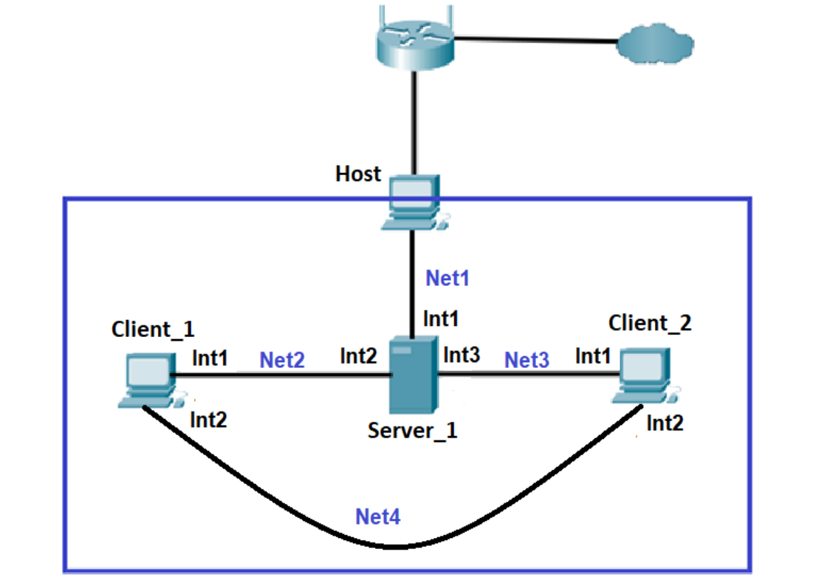
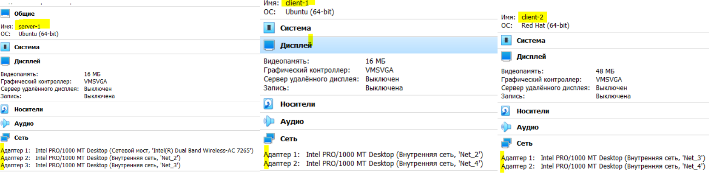
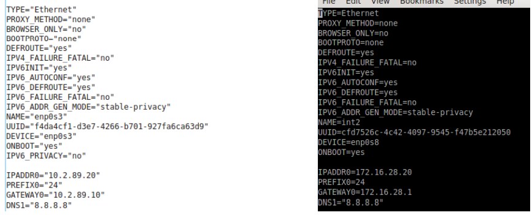
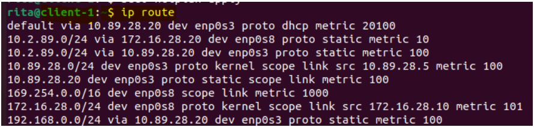
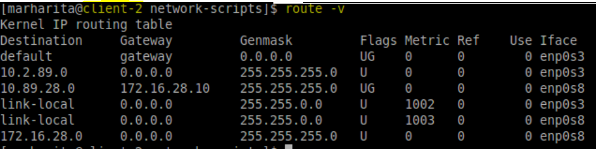
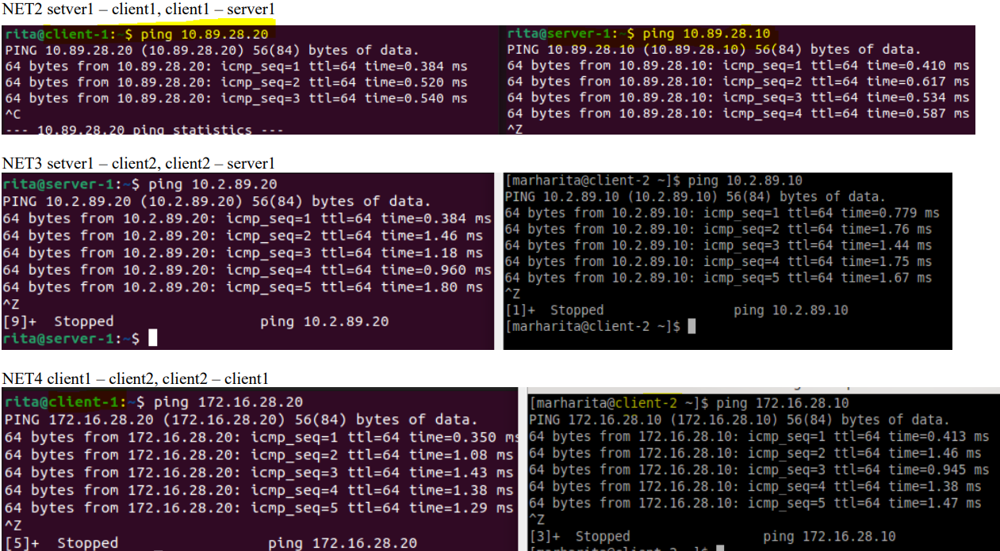

# **EPAM University Programs DevOps external course**
##              Module – Linux Networking
 The practical part of the Linux Networking module involves creation network shown in Figure 1 by means Virtual Box
 
  
 
                                   Figure 1 
 
 Host is the computer on which Virtual Box is running;  
 + Server_1 – A virtual machine on which the Linux OS is deployed. 
 Int1 of this machine in "Network bridge" mode is connected to the Net1 network, that is, it is in the address space of the home network. 
 The IP address of Int1 is set statically according to the address space, for 
example 192.168.1.200/24. Interfaces Int2 and Int3 are respectively connected in "Internal 
network" mode to networks Net2 and Net3

+ Client_1 and Client_2 – Virtual machines running Linux (preferably different distributions such as Ubuntu and CentOS). The interfaces are connected in "Internal network" mode to Net2, 
Net3 and Net4 networks as shown in Figure 1

  + The Net2 network address is 10.Y.D.0/24

  + The Net4 network address is 172.16.D.0/24
> **WARNING!** If the Net2, Net3, or Net4 address space overlaps with the Net1 address 
space, the corresponding address can be changed at your discretion.

## **0. Virtualbox setting**
+ create virtual machines according to the requirements of the task
+  configure virtual adapters according to the diagram in Figure 1:
  


## **1. Configure static addresses on all interfaces on Server_1**
Server-1 and client-1 are configured on ubuntu 22.04.
Client-2 - on Centos 7.


For permanent IP Address Assignment change the configuration file
/etc/netplan/*.yaml (Ubuntu starting with 18.04) 
+ **server-1** :
  - 

> `$ sudo nano /etc/netplan/01-network-manager-all.yaml`

```yaml
#Let NetworkManager manage all devices on this system
network:
  version: 2
  renderer: NetworkManager
  ethernets:
    enp0s3:
      addresses: [192.168.0.101/24]
      routes:
        - to: default
          via: 192.168.0.1
      nameservers:
        addresses: [8.8.8.8, 8.8.8.4]
      dhcp4: no
    enp0s8:
      addresses: [10.89.28.20/24]
      nameservers:
        addresses: [192.168.0.1]
      dhcp4: no
    enp0s9:
      addresses: [10.2.89.10/24]
      nameservers:
        addresses: [192.168.0.1]
      dhcp4: no

$ sudo netplan try
$ sudo netplan apply
```
Check and apply setting


+ **client-1:**
  - 

`$ sudo nano /etc/netplan/01-network-manager-all.yaml`
```yaml
# Let NetworkManager manage all devices on this system
network:
  version: 2
  renderer: NetworkManager
  ethernets:
    enp0s3:
      addresses: [10.89.28.10/24]
      dhcp4: no
    enp0s8:
      addresses: [172.16.28.10/24]
      dhcp4: no
```

`$ sudo netplan try`

`$ sudo netplan apply`

+ **client-2:**
  - 
 add interfaces:

 `$ nmcli con add ifname enp0s8 type ethernet`

 Network’s configuration files (CentOS, Read Head) are in 
/etc/sysconfig/network-scripts/.
Files names are: ifcfg-enp0s3,  ifcfg-enp0s8

`$ sudo vi /etc/sysconfig/network-scripts/ifcfg-enp0s3`

`$ sudo vi /etc/sysconfig/network-scripts/ifcfg-enp0s8`

Permanent IP Address Assignment client-2:


`$ sudo systemctl restart networking`

### *Permanent routing configuration in client`s-1 configure file*
```yaml
network:
  version: 2
  renderer: NetworkManager
  ethernets:
    enp0s3:
      routes:
        - to: 192.168.0.0/24
          via: 10.89.28.20
        - to: 10.2.89.0/24
          via: 10.89.28.20
          metric: 100
      nameservers:
        addresses: [8.8.8.8, 192.168.0.1]
      dhcp4: yes
    enp0s8:
      addresses: [172.16.28.10/24]
      dhcp4: no
      routes:
        - to: 10.2.89.0/24
          via: 172.16.28.20
          metric: 10
```
` $ ip route`



### *Permanent routing configuration in client`s-2 configure file*

 `$ cd /etc/sysconfig/network-scripts`

 create:

`[marharita@client-2 network-scripts]$ sudo vi route-enp0s3`
```
ADDRESS0=10.2.89.0
NETMASK0=255.255.255.0
GATEWAY0=10.2.89.5

ADDRESS1=10.89.28.0
NETMASK1=255.255.255.0
GATEWAY1=10.2.89.10

ADDRESS2=192.168.0.0
NETMASK2=255.255.255.0
GATEWAY2=10.2.89.10
```

`[marharita@client-2 network-scripts]$ sudo vi route-enp0s8`

```
ADDRESS0=172.16.28.0
NETMASK0=255.255.255.0
GATEWAY0=172.16.28.20

ADDRESS1=10.89.28.0
NETMASK1=255.255.255.0
GATEWAY1=172.16.28.10
```
`$ route -v`



### *Check internal net connection*
`$ ping < int_net IP addr >`




