# **EPAM University Programs DevOps external course**

## Module – Linux Networking
 The practical part of the Linux Networking module involves creation network shown in Figure 1 by means Virtual Box
 
 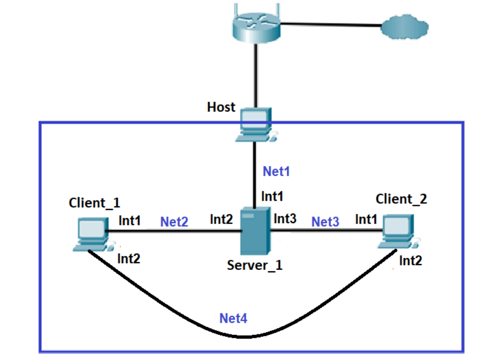
 Figure 1 
 
 Host is the computer on which Virtual Box is running;  
 + Server_1 – A virtual machine on which the Linux OS is deployed. 
 Int1 of this machine in "Network bridge" mode is connected to the Net1 network, that is, it is in the address space of the home network. 
 The IP address of Int1 is set statically according to the address space, for 
example 192.168.1.200/24. Interfaces Int2 and Int3 are respectively connected in "Internal 
network" mode to networks Net2 and Net3

+ Client_1 and Client_2 – Virtual machines running Linux (preferably different distributions such as Ubuntu and CentOS). The interfaces are connected in "Internal network" mode to Net2, 
Net3 and Net4 networks as shown in Figure 1

  + The Net2 network address is 10.Y.D.0/24

  + The Net4 network address is 172.16.D.0/24
> **WARNING!** If the Net2, Net3, or Net4 address space overlaps with the Net1 address 
space, the corresponding address can be changed at your discretion.
----
## **0. Virtualbox setting**
+ create virtual machines according to the requirements of the task
+  configure virtual adapters according to the diagram in Figure 1:
  
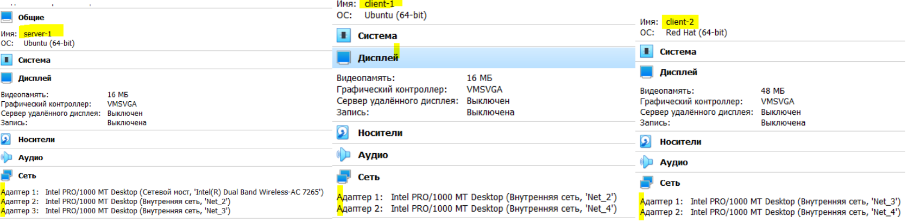

----
## **1. Configure static addresses on all interfaces on Server_1**
Server-1 and client-1 are configured on ubuntu 22.04.
Client-2 - on Centos 7.


Fig.2 Network equivalent scheme


For permanent IP Address Assignment change the configuration file
/etc/netplan/*.yaml (Ubuntu starting with 18.04) 
+ *server-1* : 

`$ sudo nano /etc/netplan/01-network-manager-all.yaml`

```yaml
#Let NetworkManager manage all devices on this system
network:
  version: 2
  renderer: NetworkManager
  ethernets:
    enp0s3:
      addresses: [192.168.0.101/24]
      routes:
        - to: default
          via: 192.168.0.1
      nameservers:
        addresses: [8.8.8.8, 8.8.8.4]
      dhcp4: no
    enp0s8:
      addresses: [10.89.28.20/24]
      nameservers:
        addresses: [192.168.0.1]
      dhcp4: no
    enp0s9:
      addresses: [10.2.89.10/24]
      nameservers:
        addresses: [192.168.0.1]
      dhcp4: no

```
` $ sudo netplan try`
`$ sudo netplan apply`

Check and apply setting


 + *client-1:*

`$ sudo nano /etc/netplan/01-network-manager-all.yaml`
```yaml
# Let NetworkManager manage all devices on this system
network:
  version: 2
  renderer: NetworkManager
  ethernets:
    enp0s3:
      addresses: [10.89.28.10/24]
      dhcp4: no
    enp0s8:
      addresses: [172.16.28.10/24]
      dhcp4: no
```

`$ sudo netplan try`

`$ sudo netplan apply`

+ **client-2:**
  - 
 Connection creation:

 `$ nmcli con add ifname enp0s8 type ethernet`

 Network’s configuration files (CentOS, Read Head) are in 
/etc/sysconfig/network-scripts/.
Files names are: ifcfg-enp0s3,  ifcfg-enp0s8

`$ sudo vi /etc/sysconfig/network-scripts/ifcfg-enp0s3`

`$ sudo vi /etc/sysconfig/network-scripts/ifcfg-enp0s8`

Permanent IP Address Assignment client-2:
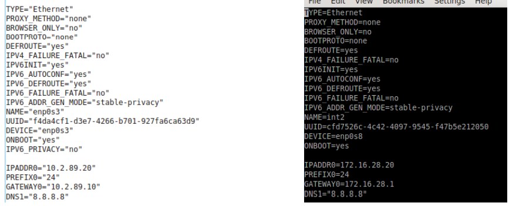

`$ sudo systemctl restart networking`

### *Permanent routing configuration in client`s-1 configure file*
```yaml
network:
  version: 2
  renderer: NetworkManager
  ethernets:
    enp0s3:
      routes:
        - to: 192.168.0.0/24
          via: 10.89.28.20
        - to: 10.2.89.0/24
          via: 10.89.28.20
          metric: 100
      nameservers:
        addresses: [8.8.8.8, 192.168.0.1]
      dhcp4: yes
    enp0s8:
      addresses: [172.16.28.10/24]
      dhcp4: no
      routes:
        - to: 10.2.89.0/24
          via: 172.16.28.20
          metric: 10
```
` $ ip route`

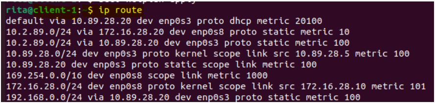

### *Permanent routing configuration in client`s-2 configure file*

 `$ cd /etc/sysconfig/network-scripts`

 create route files:

`[marharita@client-2 network-scripts]$ sudo vi route-enp0s3`
```
ADDRESS0=10.2.89.0
NETMASK0=255.255.255.0
GATEWAY0=10.2.89.5

ADDRESS1=10.89.28.0
NETMASK1=255.255.255.0
GATEWAY1=10.2.89.10

ADDRESS2=192.168.0.0
NETMASK2=255.255.255.0
GATEWAY2=10.2.89.10
```

`[marharita@client-2 network-scripts]$ sudo vi route-enp0s8`

```
ADDRESS0=172.16.28.0
NETMASK0=255.255.255.0
GATEWAY0=172.16.28.20

ADDRESS1=10.89.28.0
NETMASK1=255.255.255.0
GATEWAY1=172.16.28.10
```
`$ route -v`

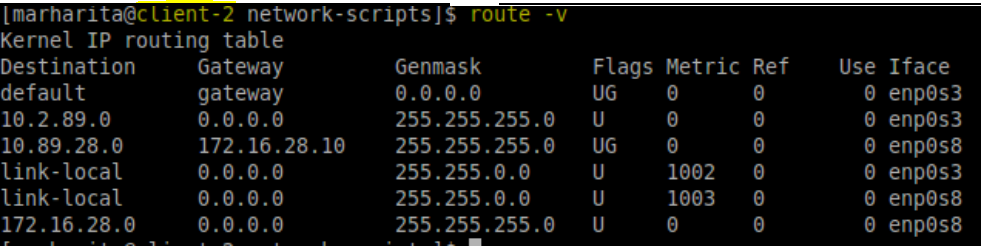

### *Check internal net connection*
`$ ping < int_IP_addr >`

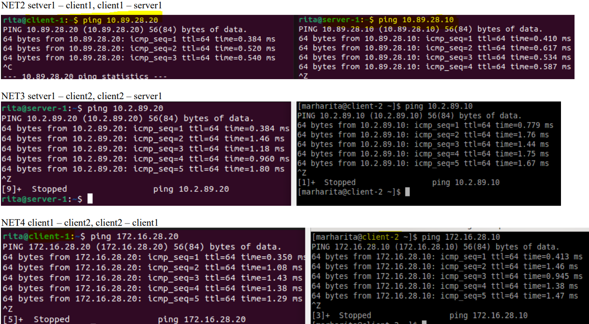

----

## **2. Configure the DHCP service on Server_1, which will configure the Int1 addresses of Client_1 and Client_2**

` $ sudo nano /etc/sysctl.conf`

uncomment:

> net.ipv4.ip_forward=1

+ At a terminal prompt, enter the following command to install dhcpd:

`$ sudo apt install isc-dhcp-server`

+ On what interfaces should the DHCP server (dhcpd) serve DHCP requests? Uncomment and add interfaces name: 


`$ sudo nano /etc/default/isc-dhcp-server`

```bash
#Separate multiple interfaces with spaces, e.g. "eth0 eth1".
INTERFACESv4="enp0s8 enp0s9"
INTERFACESv6="enp0s8 enp0s9"
```

+ Change the default configuration, edit /etc/dhcp/dhcpd.conf:

```bash
# A slightly different configuration for an internal subnet
###############     client-1 Ubuntu       #################

subnet 10.89.28.0 netmask 255.255.255.0 {
  range 10.89.28.5 10.89.28.30;
  option domain-name-servers internal2.myserv1.ubu;
  option domain-name "myserv1.ubu";
  option subnet-mask 255.255.255.0;
  option routers 10.89.28.20;
  option broadcast-address 10.89.28.255;
  default-lease-time 720;
  max-lease-time 7200;
  }

###############     client-2 Centos7       #################

subnet 10.2.89.0 netmask 255.255.255.0 {
  range 10.2.89.5 10.2.89.30;
  option domain-name-servers internal2.myserv1.ubu;
  option domain-name "myserv1.ubu";
  option subnet-mask 255.255.255.0;
  option routers 10.2.89.10;
  option broadcast-address 10.2.89.255;
  default-lease-time 720;
  max-lease-time 7200; 
  }
```

+ Edit DHCP configuration files client-1 & client-2:

  +  dhcp4:yes  for enp0s3 client-1
  +   BOOTPROTO="dhcp" for enp0s3 client-2

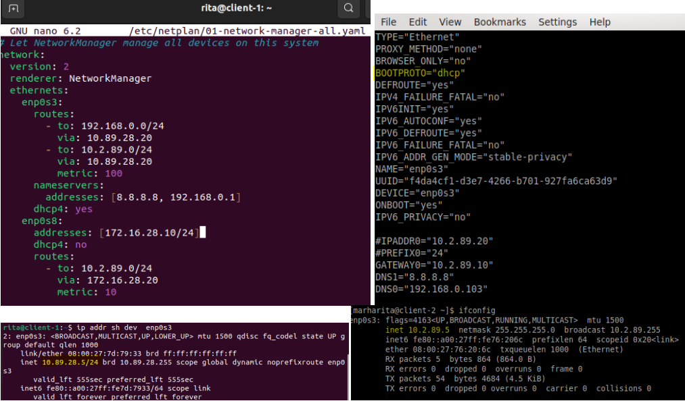


+ After changing the config files, you must restart the dhcpd service:

`$ sudo systemctl restart isc-dhcp-server.service`

+ DHCP server verification.
To review all actual leased IP-addresses:

`$ dhcp-lease-list`

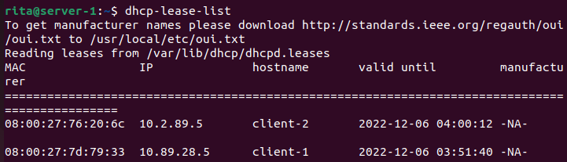

---

## **3.	Using the ping and traceroute commands, check the connection between VM. Explain the result**

+ 3.1 Use: `$ ping <IP_addr>`

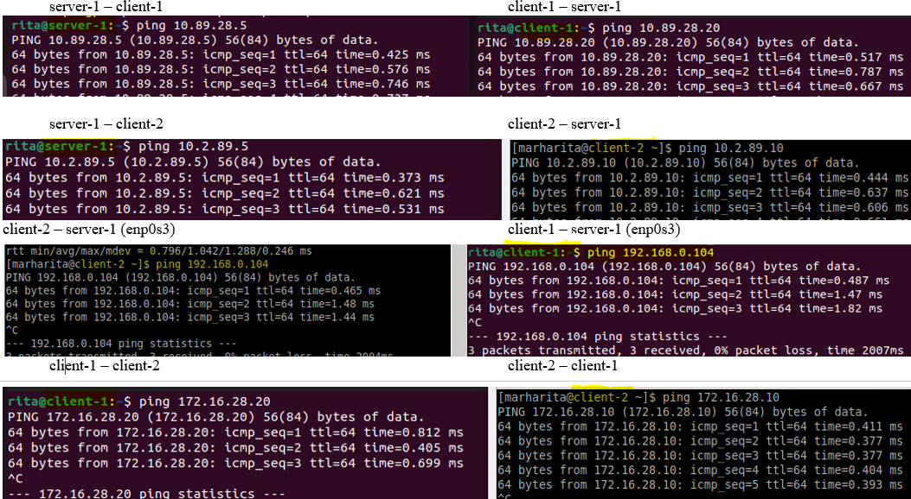

> All pings go in both directions between all virtual machines. Therefore, a connection is established between VM interfaces in the local network.

+ 3.2 Use:  `$ traceroute <IP_addr>`

> Command traceroute was used for all interfaces in local network and for router (192.168.0.1). Addresses were entered for interfaces located clockwise in the network diagram (see Fig. 2). The result of the traceroute command can be seen below

+ *Traceroute server-1* 


```
rita@server-1:~$ traceroute 10.2.89.5
traceroute to 10.2.89.5 (10.2.89.5), 30 hops max, 60 byte packets
 1  10.2.89.5 (10.2.89.5)  46.271 ms !X  46.287 ms !X  46.177 ms !X

rita@server-1:~$ traceroute 172.16.28.20
traceroute to 172.16.28.20 (172.16.28.20), 30 hops max, 60 byte packets
 1  10.89.28.6 (10.89.28.6)  1.888 ms  1.776 ms  1.717 ms
 2  172.16.28.20 (172.16.28.20)  1.406 ms !X  1.258 ms !X  1.221 ms !X
 
rita@server-1:~$ traceroute 172.16.28.10
traceroute to 172.16.28.10 (172.16.28.10), 30 hops max, 60 byte packets
 1  172.16.28.10 (172.16.28.10)  0.932 ms  0.894 ms  0.867 ms

rita@server-1:~$ traceroute 10.89.28.6
traceroute to 10.89.28.6 (10.89.28.6), 30 hops max, 60 byte packets
 1  10.89.28.6 (10.89.28.6)  2.242 ms  0.513 ms  0.381 ms

rita@server-1:~$ traceroute 10.89.28.20
traceroute to 10.89.28.20 (10.89.28.20), 30 hops max, 60 byte packets
 1  server-1 (10.89.28.20)  0.492 ms  0.453 ms  0.437 ms

rita@server-1:~$ traceroute 192.168.0.104
traceroute to 192.168.0.104 (192.168.0.104), 30 hops max, 60 byte packets
 1  server-1 (192.168.0.104)  0.388 ms  0.331 ms  0.314 ms

rita@server-1:~$ traceroute 192.168.0.1
traceroute to 192.168.0.1 (192.168.0.1), 30 hops max, 60 byte packets
 1  _gateway (192.168.0.1)  4.804 ms  5.500 ms  5.477 ms

rita@server-1:~$ traceroute 8.8.8.8
traceroute to 8.8.8.8 (8.8.8.8), 30 hops max, 60 byte packets
 1  _gateway (192.168.0.1)  6.174 ms  6.117 ms  6.095 ms
 2  10.2.13.1 (10.2.13.1)  8.067 ms  9.359 ms  8.765 ms
 3  178.158.194.161 (178.158.194.161)  10.254 ms  9.832 ms  9.793 ms
 4  10.255.253.15 (10.255.253.15)  10.558 ms  10.536 ms  11.744 ms
 5  10.255.249.1 (10.255.249.1)  10.367 ms  11.026 ms  11.004 ms
 6  google.1-ix.net (185.1.213.44)  18.336 ms google-gw.ix.net.ua (185.1.50.166)  5.912 ms dtel-ix-3.google.com (193.25.181.70)  7.072 ms
 7  108.170.248.138 (108.170.248.138)  6.398 ms 108.170.248.155 (108.170.248.155)  5.783 ms 108.170.248.138 (108.170.248.138)  9.330 ms
 8  72.14.239.111 (72.14.239.111)  10.309 ms 142.251.242.39 (142.251.242.39)  22.939 ms  23.892 ms
 9  142.250.46.55 (142.250.46.55)  24.879 ms 108.170.250.209 (108.170.250.209)  25.797 ms 142.251.77.181 (142.251.77.181)  24.828 ms
10  172.253.65.37 (172.253.65.37)  24.811 ms 216.239.40.43 (216.239.40.43)  27.573 ms 74.125.242.225 (74.125.242.225)  27.714 ms
11  142.251.228.27 (142.251.228.27)  25.685 ms 142.250.238.1 (142.250.238.1)  27.683 ms 108.170.234.101 (108.170.234.101)  19.074 ms
12  dns.google (8.8.8.8)  18.990 ms  17.984 ms  20.937 ms
```

+ *Traceroute client-1* 


+ *Traceroute client-2* 


> !X means "communication administratively prohibited" on client-2
------


## **4. On the virtual interface lo Client_1, assign two IP addresses according to the following rule: 172.17.D+10.1/24, 172.17.D+20.1/24.** 
+ Add following two IP addresse into client's-1 Loopback Interface:
> 172.17.38.1/24

`$ sudo ip addr add 172.17.38.1/24 dev  lo`

> 172.17.48.1/24

`$ sudo ip addr add 172.17.48.1/24 dev  lo`


```bash
rita@client-1:~$ ip addr sh lo
1: lo: <LOOPBACK,UP,LOWER_UP> mtu 65536 qdisc noqueue state UNKNOWN group default qlen 1000
    link/loopback 00:00:00:00:00:00 brd 00:00:00:00:00:00
    inet 127.0.0.1/8 scope host lo
       valid_lft forever preferred_lft forever
    inet 172.17.38.1/24 scope global lo
       valid_lft forever preferred_lft forever
    inet 172.17.48.1/24 scope global lo
       valid_lft forever preferred_lft forever
    inet6 ::1/128 scope host 
       valid_lft forever preferred_lft forever
```
### **Configure routing so that traffic from Client_2 to 172.17.38.1 goes through Server_1, and to 172.17.48.1 through Net4. To check, use traceroute.**
+ server-1

```
rita@server-1:~$ sudo ip route add 172.17.38.0/24 via 10.89.28.5
rita@server-1:~$ ping 172.17.38.1
PING 172.17.38.1 (172.17.38.1) 56(84) bytes of data.
64 bytes from 172.17.38.1: icmp_seq=1 ttl=64 time=0.377 ms
^C
```
+ client-2 

`$ sudo ip route add 172.17.38.0/24 via 10.2.89.10`

`$ sudo ip route add 172.17.48.0/24 via 172.16.28.10`

```bash
[marharita@client-2 ~]$ traceroute 172.17.38.1
traceroute to 172.17.38.1 (172.17.38.1), 30 hops max, 60 byte packets
 1  gateway (10.2.89.10)  0.455 ms  0.386 ms  0.346 ms
 2  172.17.38.1 (172.17.38.1)  0.868 ms  0.864 ms  0.913 ms
 
[marharita@client-2 ~]$ traceroute 172.17.48.1
traceroute to 172.17.48.1 (172.17.48.1), 30 hops max, 60 byte packets
 1  172.17.48.1 (172.17.48.1)  0.473 ms  0.483 ms  0.364 ms
[marharita@client-2 ~]$ 
```
----

## **5 Calculate the common address and mask (summarizing) addresses 172.17.D+10.1 and 172.17.D+20.1, and the prefix should be as large as possible.   Delete the routes set in the previous step and replace them with the combined route that should go through Server_1**

+ 5.1 Summarizing

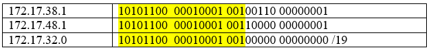

| 172.17.32.0 | 10101100  00010001 00100000 00000000 /19|
|------|-------|
| 172.17.38.1 | 10101100 00010001 00100110 00000001|
| 172.17.48.1 | 10101100  00010001 00110000 00000001|
 

+ 5.2 Delete the routes set in the previous step
  + server-1:

  `$ sudo ip route del 172.17.38.0/24 via 10.89.28.5`
  + client-2:

   `$ sudo ip route del 172.17.48.0/24 via 172.16.28.10` 
   
   `$ sudo ip route del 172.17.38.0/24 via 10.2.89.10`
+ 5.3 Add summarizing address:
  + server-1:

  `sudo ip route add 172.17.32.0/19 via 10.89.28.5`

 + 5.4 Use traceroute
   + client2:

   `$ traceroute 172.17.38.1`  
   `$ traceroute 172.17.48.1`

   

----


## **6. Configure the SSH service so that Client_1 and Client_2 can connect to Server_1 and each other.**
+ 6.1   SSH installation 

  + SSH server installation for Ubuntu (server-1, client-1): 

`$ sudo apt-get install openssh-server`

+ + for Centos 7 (client-2):

`$ sudo yum –y install openssh-server openssh-clients` 
+ 6.2 First SSH connecting 
  + client-1 to server-1

  `$ ssh rita@10.89.28.20`

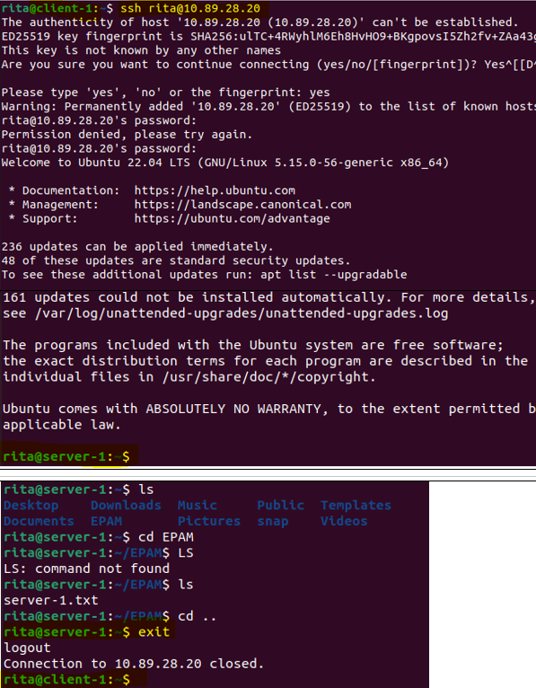
+ client-2 to server-1

  `$ ssh rita@10.2.89.10`
  
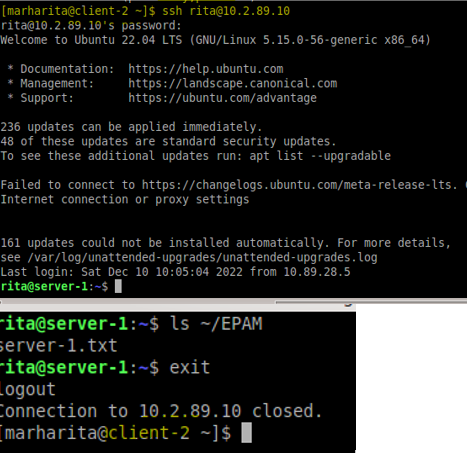

+ 6.3. Key authentication config  
`$ ssh-keygen`

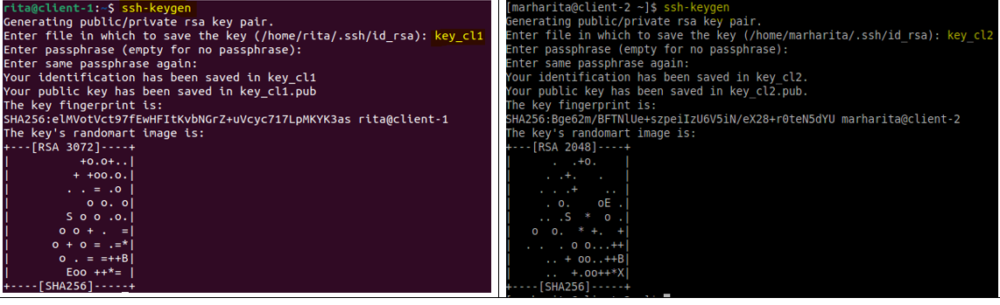
 
 Сopying the public key to the server
  + *from client-1:*

`$ ssh-copy-id -i key_cl1.pub rita@10.89.28.20`
  + *from client-2:*

`$ ssh-copy-id -i key_cl2.pub rita@10.2.89.10`

Change the port on which the ssh server is running. Enable public key authentication and disable password authentication on the server

`$ sudo nano /etc/ssh/sshd_config`

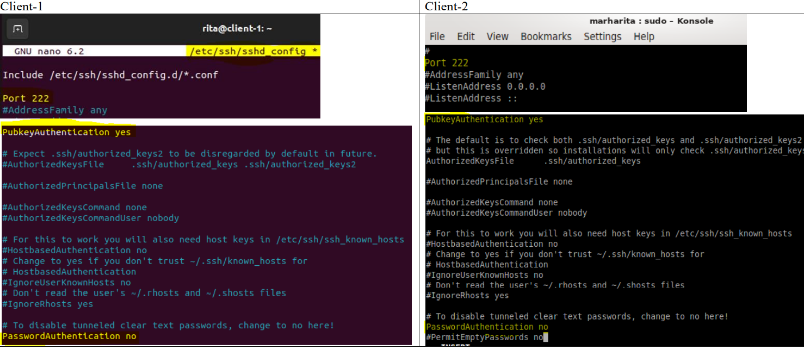

Connection to Server

  + client-1 to server-1:

`$ ssh -i key_cl1.pub rita@10.89.28.20`
  + client-2 to server-1:

`$ ssh -i key_cl2.pub rita@10.2.89.10`

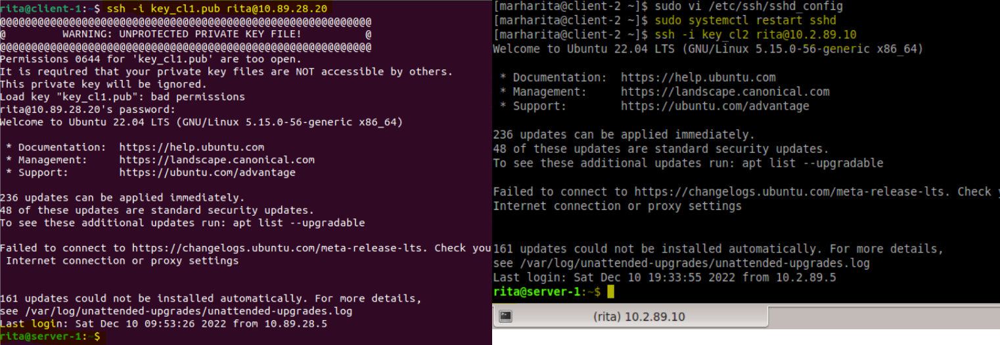

+ 6.4 To simple SSH connection add a new entry to /etc/ssh/ssh_config file


To connect to the server: 

`$ ssh server`

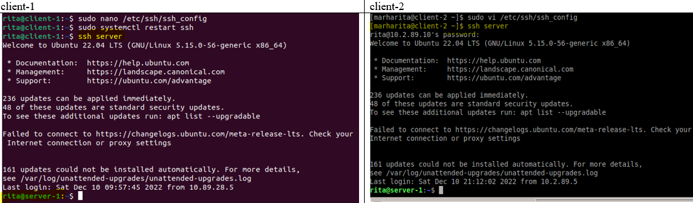

+ 6.5 Client_1 and Client_2 can connect to each other by Net4 (see Fig.1). 
  + client-1: `$ ssh rita@172.16.28.20`
  + client-2: `$ ssh rita@172.16.28.10`

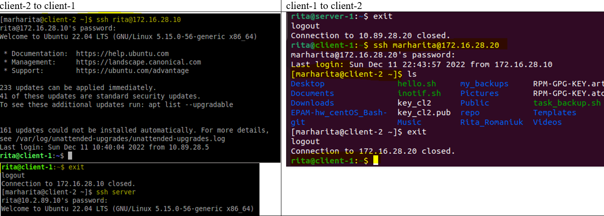

-----
## **7. Configure the firewall on Server_1 as follows:**
- Allowed to connect via SSH from Client_1 and forbidden from Client_2 
- From Client_2 to 172.17.D+10.1 the ping was successful, but to 172.17.D+20.1 it was not successful
  
+ **7.0 Before configure of firewall on server-1 see iptables. To check filter tables:**
  
`$ sudo iptables -L` 

```
rita@server-1:~$ sudo iptables -L
[sudo] password for rita: 
Chain INPUT (policy ACCEPT)
target     prot opt source               destination         

Chain FORWARD (policy ACCEPT)
target     prot opt source               destination         

Chain OUTPUT (policy ACCEPT)
target     prot opt source               destination  
```
+ before addin rules client-2 connect via SSH is successful:

```
[marharita@client-2 ~]$ ssh server
rita@10.2.89.10's password: 
Welcome to Ubuntu 22.04 LTS (GNU/Linux 5.15.0-56-generic x86_64)

 * Documentation:  https://help.ubuntu.com
 * Management:     https://landscape.canonical.com
 * Support:        https://ubuntu.com/advantage

210 updates can be applied immediately.
17 of these updates are standard security updates.
To see these additional updates run: apt list --upgradable

161 updates could not be installed automatically. For more details,
see /var/log/unattended-upgrades/unattended-upgrades.log
*** System restart required ***
Last login: Sun Dec 11 22:46:19 2022 from 10.89.28.6
rita@server-1:~$ 
```
+ pingin before addin rules:
```
[marharita@client-2 ~]$ ping 172.17.38.1
PING 172.17.38.1 (172.17.38.1) 56(84) bytes of data.
64 bytes from 172.17.38.1: icmp_seq=1 ttl=63 time=0.758 ms

[marharita@client-2 ~]$ ping 172.17.48.1
PING 172.17.48.1 (172.17.48.1) 56(84) bytes of data.
64 bytes from 172.17.48.1: icmp_seq=1 ttl=63 time=1.14 ms
64 bytes from 172.17.48.1: icmp_seq=2 ttl=63 time=3.70 ms
```

+ **7.1 Adding rules acording the task:**
   
`$ sudo iptables -A FORWARD -p icmp -d 172.17.48.1 -j DROP`

`$ sudo iptables -A FORWARD -p tcp -d 10.2.89.0/255.255.255.0 --dport ssh -j DROP`
+ see output:
```
rita@server-1:~$ sudo iptables -L
Chain INPUT (policy ACCEPT)
target     prot opt source               destination         

Chain FORWARD (policy ACCEPT)
target     prot opt source               destination         
DROP       tcp  --  anywhere             10.2.89.0/24         tcp dpt:ssh
DROP       icmp --  anywhere             172.17.48.1         

Chain OUTPUT (policy ACCEPT)
target     prot opt source               destination
```   
+ **after adding rules** client-2 can't connect via SSH to server-1:
```
[marharita@client-2 ~]$ ssh rita@10.2.89.10
123
^C
[marharita@client-2 ~]$ ssh server
^C
[marharita@client-2 ~]$ ssh server
^C
```
+ **after adding rules**: from Client_2 to 172.17.38.1 the ping was successful, but to 172.17.48.1 it was not successful
```
[marharita@client-2 ~]$ ping 172.17.38.1
PING 172.17.38.1 (172.17.38.1) 56(84) bytes of data.
64 bytes from 172.17.38.1: icmp_seq=1 ttl=63 time=0.906 ms
64 bytes from 172.17.38.1: icmp_seq=2 ttl=63 time=2.65 ms
^C

[marharita@client-2 ~]$ ping 172.17.48.1
PING 172.17.48.1 (172.17.48.1) 56(84) bytes of data.
^C
--- 172.17.48.1 ping statistics ---
15 packets transmitted, 0 received, 100% packet loss, time 14003ms
```

+ to delete rule use key -D (or -F ,--flush deleting all rules):

`$ sudo iptables -D FORWARD -p tcp -d 10.2.89.0/255.255.255.0 --dport ssh -j DROP`

`$ sudo iptables -F`

---
## **8. Configure NAT on Server_1 service in such a way that Client_1 and Client_2 ping the Internet**

+ See NAT tables:  `$ sudo iptables -t nat -L`
```
rita@server-1:~$ sudo iptables -t nat -L
[sudo] password for rita: 
Chain PREROUTING (policy ACCEPT)
target     prot opt source               destination         

Chain INPUT (policy ACCEPT)
target     prot opt source               destination         

Chain OUTPUT (policy ACCEPT)
target     prot opt source               destination         

Chain POSTROUTING (policy ACCEPT)
target     prot opt source               destination         
```
+ calculate summrizing IP address for local network:
  
| 10.0.0.0/9 | 00001010 00000000 00000000 00000000 /9| 
| ------------|-----------------------------------|
| 10.89.28.5	| 00001010  01011001  00011100  00000101| 
|10.2.89.5 	| 00001010  00000010  01011001  00000101|

+ Add following ruls in NAT tables (according task):

```
$ sudo iptables -t nat -A POSTROUTING -s 10.0.0.0/9 -j SNAT --to-source 192.168.0.103
$ sudo iptables -t nat -A POSTROUTING -o enp0s3 -j MASQUERADE
$ sudo iptables -t nat -D POSTROUTING 1
```
+ See NAT tables arter addin rules:
```
rita@server-1:~$ sudo iptables -t nat -L
Chain PREROUTING (policy ACCEPT)
target     prot opt source               destination         

Chain INPUT (policy ACCEPT)
target     prot opt source               destination         

Chain OUTPUT (policy ACCEPT)
target     prot opt source               destination         

Chain POSTROUTING (policy ACCEPT)
target     prot opt source               destination         
MASQUERADE  all  --  anywhere             anywhere            
```
+ See result in client-1.txt, client-2.txt (try to ping the Internet):

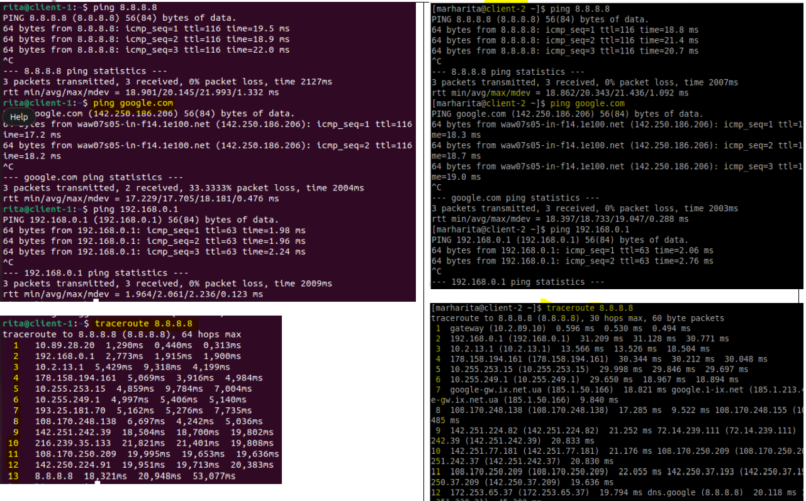

*As we see pings are successful from both clients*


  


