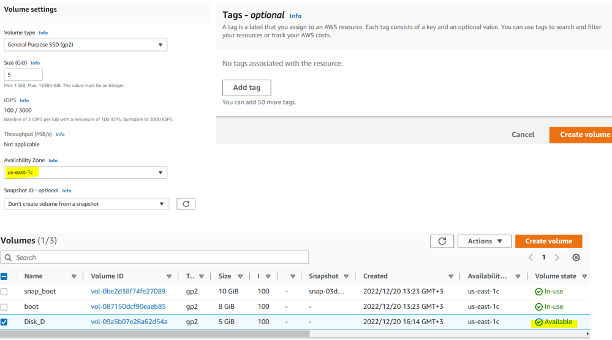

## EPAM University Programs Cloud&DevOps Fundamentals Autumn 2022 
# AWS Cloud Basic

## 1. Read the terms of Using the [AWS Free Tier](.https://docs.aws.amazon.com/en_us/awsaccountbilling/latest/aboutv2/billing-free-tier.html) and the ability to control their own costs.
   
+ Free Trials Short-term free trial offers start from the date you activate a particular service

+ 12 months free Enjoy these offers for 12-months following your initial sign-up date to AWS

> Information about limits of Free Tier: User -> Billing -> Free Tier


+ Ability to control own cost achive via creating billing alarm:

Create Billing Alarm for expense notification (I already have one so I just edit some steps):
Choose CloudWatch -> Create alarm -> Do the following steps:
+ Step1 Specify metric and conditions 				
+ Step2 Configure actions
  


+ Step 3 Add name and description  
+ Step 4 Preview and create
+ After creating alarm confirm receipt of notifications on your email


## 2. [Register with AWS](.https://portal.aws.amazon.com/billing/signup?redirect_url=https%3A%2F%2Faws.amazon.com%2Fregistration-confirmation#/start) (first priority) or alternatively, you can request access to courses in [AWS Academy](.https://aws.amazon.com/ru/training/awsacademy/member-list/) if you are currently a student of certain [University](.https://aws.amazon.com/ru/training/awsacademy/member-list/).

## 3. Find the [hands-on tutorials](.https://aws.amazon.com/ru/getting-started/hands-on/?awsf.getting-started-category=category%23compute&awsf.getting-started-content-type=content-type%23hands-on&?e=gs2020&p=gsrc&awsf.getting-started-level=*all) and [AWS Well-Architected Labs](.https://www.wellarchitectedlabs.com/) for your AWS needs. Explore list of step-by-step tutorials for deferent category. Use, repeat as many as you can and have fun))
   

## 4. Register and pass courses on [AWS Educate](.https://aws.amazon.com/ru/education/awseducate/). Filter by checking Topic Cloud Computing and Foundational Level. Feel free to pass more.

## 5. Register and pass free courses on [AWS Skillbuilder](.https://explore.skillbuilder.aws/learn). AWS Cloud Practitioner Essentials: Core Services, AWS Cloud Practitioner Essentials: Cloud Concepts. Try AWS Cloud Quest: Cloud Practitioner.

## 6. Pass free courses on [Amazon qwiklabs](.https://amazon.qwiklabs.com/)

----
## 7. Review [Getting Started with Amazon EC2](.https://aws.amazon.com/ru/ec2/getting-started/?nc1=h_ls). Log Into Your AWS Account, Launch,  Configure, Connect and Terminate Your Instance. 
Do not use Amazon Lightsail. It is recommended to use the t2 or t3.micro instance and the CentOS operating system.

+ Launch Instance:
  


+ Configure:


+ Connect:
  + See running Instance:
  


+ Terminate:


----
## 8. Create a snapshot of your instance to keep as a backup.


---
## 9. Create and attach a Disk_D (EBS) to your instance to add more storage space. Create and save some file on Disk_D.

- Create Volume (EBS):
  


-	Volume setting. 
> Remember: Availability Zone must be same to Volume and Instance by that it be attached



-	Attach volume:


- Connect to Instance and **Mount Disk_D** ([setting guid](.https://thinkcloudly.com/how-to-create-an-ebs-volume)):

> `$ sudo lsblk`  and get `xvdf` as the Disk_D name:


To mount Disk_D, we must first access it. Type  ` $ sudo file -s /dev/xvdf `

Output will give us `data` that means there is no file system on the device and we have to create one. Use command (ext4 is for formatting):

`$ sudo mkfs -t ext4 /dev/xvdf ` 


Type `sudo mkdir /data` “data” folder is created and it will show as `xvdf/data`

Now to mount it:  `sudo mount /dev/xvdf /data`.

To confirm type `lsblk` and press enter and you will see `xvdf` is mounted to the data folder.


Go to data folder by typing `cd /data`

Make a file: type `sudo touch EPAM-task.txt` 

To confirm it is created or not type `ls -la`


Edit file using VI editor here. Type `sudo vi EPAM-task.txt`

Type `cat EPAM-task.txt`. See output `hello, EPAM!`


---

## 10.   Launch the second instance from backup.
   


- Launch Instance from created AMI:
  


----
## 11.   Detach Disk_D from the 1st instance and attach disk_D to the new instance.
   
+ Detach Disk_D from the 1st instance:


+ attach disk_D to the 2nd instance:


+ Connect to VMs (see commands to initially connect the disk to the system in 8th step) and check detached/attached disk


----

## 12.   Review the [10-minute example](.https://aws.amazon.com/ru/getting-started/hands-on/get-a-domain/?nc1=h_ls). Explore the possibilities of creating your own domain and domain name for your site. Note, that Route 53 not free service. Alternatively you can free register the domain name *.PP.UA and use it.

Go to "nic.ua" 
-  choose domain name (in my case it romaniuk.pp.ua)
-  complete the registration procedure

  

-  activate the domain

  
 
---

## 13.   Launch and configure a WordPress instance with Amazon Lightsail [link](.https://aws.amazon.com/ru/getting-started/hands-on/launch-a-wordpress-website/?trk=gs_card)

> **Step1: Create a WordPress instance in Lightsail**

- a. Sign in to the Lightsail console.
- b. On the Instances tab of the Lightsail home page, choose Create instance.
- c. An AWS Region and Availability Zone is selected. Choose `Change AWS Region` and Availability Zone if you want to create instance in another location.


- d. Choose instance image.
  - Choose Linux/Unix as the platform.
  - Choose WordPress as the blueprint.


- e. Choose an instance plan.


- f. Enter a name for your instance and choose Create instance("EPAM-task-WordPress-13"):
  


> **Step 2 Connect to instance via SSH and get the password for WordPress website**
- a.	On the Instances tab of the Lightsail home page, choose the SSH quick-connect icon for WordPress instance.
- b.	After the browser-based SSH client window opens, enter the following command to retrieve the default application password:
`cat $HOME/bitnami_application_password`


- c. To sign in to the administration dashboard of your WordPress website the password displayed on the screen.

> **Step 3 Sign in to the administration dashboard of WordPress website**
- a. In a browser, go to:
  `http://35.173.122.217/wp-login.php`
- b. Log in to your instance. 
   - In the Username or Email Address box, enter **user.** 
   - In the Password box, enter the default password obtained in Step 2


   - 	Choose Log in


> **Step 4 Create a Lightsail static IP address and attach it to your WordPress instance**

- a.	On the Instances tab of the Lightsail home page, choose running WordPress instance.
- b.	Choose the `Networking tab`, then choose `Create static IP`.
- c.	Select the `created WordPress instance` from the Attach to an instance dropdown.
- d.	Name your static IP, then choose `Create`. 
  


> **Step 5: Create a Lightsail DNS zone and map a domain to WordPress instance**

- a. On the Networking tab of the Lightsail home page, choose Create DNS zone. 
- b. Enter your domain, then choose Create DNS zone. 
- c. Make note of the name server address listed on the page.


- d. add DNS records:


> **Step 6: Clean up**
- a. On the Instances tab of the Lightsail home page, choose the ellipsis (`⋮`) icon next to the WordPress instance and choose `Delete`.
- b. Choose Yes, delete from the prompt.


---

## 14.   Review the [10-minute](./https://aws.amazon.com/ru/getting-started/hands-on/backup-files-to-amazon-s3/) Store and Retrieve a File. Repeat, creating your own repository.
- Open S3 service console and choose `Create bucket`:


-	Enter unique bucket name and set configuration:


-	Upload any file: 


-	Leave default setting and choose `Upload`:


-	Download file on local machine:


- Clean up: Delete object (delete file from bucket):


-  delete bucket:
  


----
   
## 15.   Review the 10-minute example Batch upload files to the cloud to Amazon S3 using the AWS CLI. Create a user AWS IAM, configure CLI AWS and upload any files to S3. 

> **Step 1: Create an AWS IAM User**


Choose: **Users** -> **Add user** 
-> select **Programmatic access** 
-> Click the **Next: Permissions**


Click on **Attach existing policies** directly option. Select AdministratorAccess then click **Next: Tags.** 


click on **Create user** and  **Download Credentials**:


> **Step 2: Install and Configure the AWS CLI**

Install the AWS CLI on local VM:
```bash
sudo yum install awscli 
```


Type `aws configure` and press enter. 
Enter the following (from the *credentials.csv* file) when prompted:


To create a new bucket named romaniuk-epam-bucket2, enter the following:
```
aws s3 mb s3://romaniuk-epam-bucket2
```


To upload the file *Task_AWS* located in the local directory (~/) to the S3 bucket *romaniuk-epam-bucket2* use the following command:
```
aws s3 cp s3 “/home/marharita/task_AWS” s3:// romaniuk-epam-bucket2
```


To delete *task_AWS*  from bucket *romaniuk-epam-bucket2*, use the following command:
```
aws s3 rm s3:// romaniuk-epam-bucket2/task_AWS
```


---

## 16.   Review the 10-minute example Deploy Docker Containers on Amazon Elastic Container Service (Amazon ECS). Repeat, create a cluster, and run the online demo application or better other application with custom settings.


## 17.   Run a Serverless "Hello, World!" with AWS Lambda.


18.  Create a static website on Amazon S3, publicly available (link1 or link2 - using a custom domain 
registered with Route 53). Post on the page your own photo, the name of the educational 
program (EPAM Cloud&DevOps Fundamentals Autumn 2022), the list of AWS services with 
which the student worked within the educational program or earlier and the full list with links 
of completed labs (based on tutorials or qwiklabs). Provide the link to the website in your report
and СV